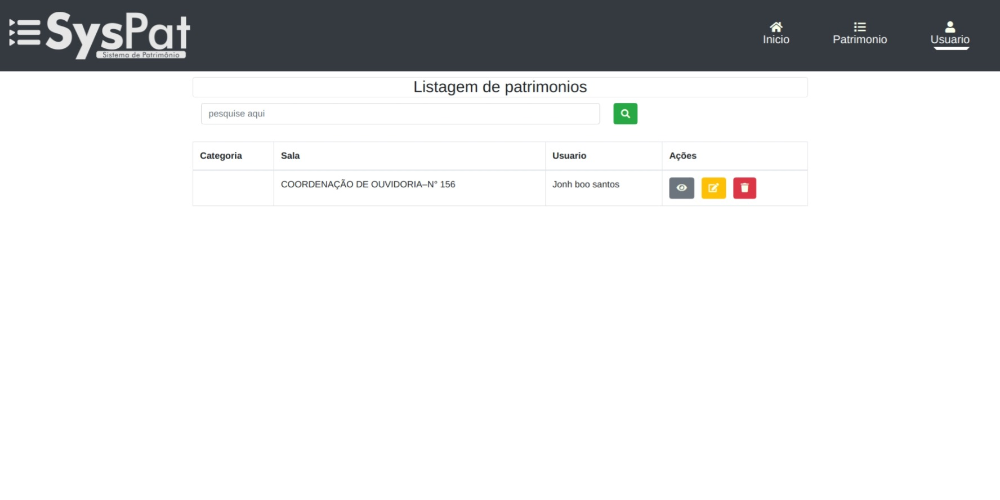

# Sispat
> Sistema de Patrimonio


### Passo a passo
Para começar é necessário ter o <a href="https://docs.docker.com/engine/install/ubuntu/">Docker</a> instalado veja no link

#### Clone o repositorio na sua maquina:
```sh
git clone https://github.com/derio123/Sispatrimonio.git
```

#### Remova o arquivo de versionamento, caso queira:
```sh
sudo rm -rf .git/
```

#### Criei o arquivo de ambiente .env:
```sh
cp .env.example .env
```

#### Atualize o arquivo .env e suas variaveis:
```sh
APP_NAME=Sispatrimonio
APP_ENV=local
APP_KEY=base64:SYZunck3hyE91Fn6ZaXys+zMwdiF3063w6f9RsHM3mA=
APP_DEBUG=true
APP_URL=http://localhost:4500

LOG_CHANNEL=stack

DB_CONNECTION=mysql
DB_HOST=mysql
DB_PORT=3306
DB_DATABASE=qualquer_nome
DB_USERNAME=root
DB_PASSWORD=qualquer_senha

CACHE_DRIVER=redis
QUEUE_CONNECTION=redis
SESSION_DRIVER=redis

REDIS_HOST=redis
REDIS_PASSWORD=null
REDIS_PORT=6379
``` 

#### Suba os serviços do container:
```sh
sudo docker-compose up -d
```
#### Acesse o container sispatrimonio:
```sh
sudo docker-compose exec app bash
``` 

#### Após entrar no bash do projeto, instale as dependências e gere a key do projeto laravel:
```sh
composer install && php artisan key:generate
```   

Após isso acesse o localhost da porta do nginx para roda o servico <a href="http://localhost:4500/">sispatrimonio</a>



>>Nota: Stacks usadas nos containers foram:
>><a href="laravel.com/">#Laravel</a></label> 
<a href="https://www.phpmyadmin.net/">#phpmyadmin</a>
<a href="https://hub.docker.com/_/mysql">#mysql</a>
<a href="https://hub.docker.com/_/nginx">#nginx</a>

